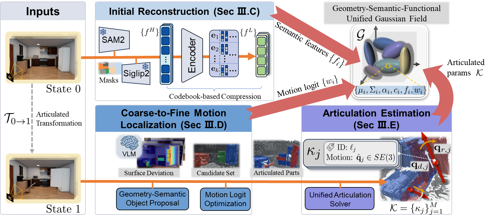
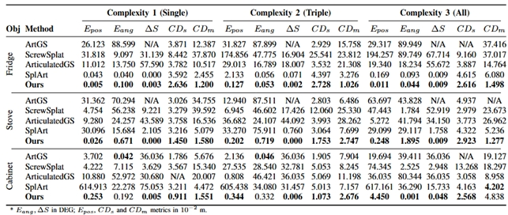
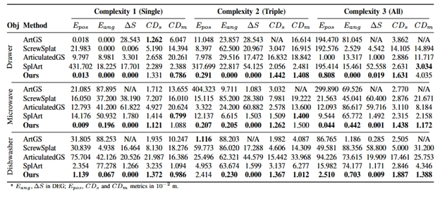

# SCAR-GS: Scene-level Contrastive Articulated Reconstruction via Actionable Semantic 3D Gaussian Splatting

[](https://www.python.org/downloads/)
[](https://pytorch.org/)
[](https://developer.nvidia.com/cuda-downloads)
[](LICENSE.md)

**[🎥 Full Video](Videolink)** | **[📊 Dataset Download](Datasetlink)** | **[📄 Paper (Coming Soon)](#)**
**SCAR-GS** is a novel framework for reconstructing and animating articulated objects from RGB-D sequences using 3D Gaussian Splatting. Our method automatically discovers articulated joints, learns per-Gaussian mobility, and generates photorealistic animations with dual quaternion-based articulation.

---

## 🎬 Demonstration Videos

Follow the system's performance across different stages, from full end-to-end demos to specific modeling and operation tasks in both simulation and real-world environments.

---

### 1. Full System Demo
**Description:** A comprehensive showcase of the end-to-end pipeline, including automated reconstruction and seamless animation.
<p align="center">
  <video src="https://github.com/user-attachments/assets/e7370a21-5c2a-4cfd-886a-fda3218838da" width="100%" controls muted autoplay loop>
    Your browser does not support the video tag.
  </video>
</p>

---

### 2. Simulation Modeling
**Description:** High-fidelity articulated object modeling and reconstruction within a controlled simulation environment.
<p align="center">
  <video src="https://github.com/user-attachments/assets/0005878d-892b-48d7-ac30-7da6905b3faf" width="100%" controls muted autoplay loop>
    Your browser does not support the video tag.
  </video>
</p>

---

### 3. Real-World Modeling
**Description:** Robust reconstruction using real sensor data (RGB-D/LiDAR) capturing complex articulated objects in the wild.
<p align="center">
  <video src="https://github.com/user-attachments/assets/55425cde-f360-47c6-a057-4b9373db6c16" width="100%" controls muted autoplay loop>
    Your browser does not support the video tag.
  </video>
</p>

---

### 4. Real-World Operation
**Description:** Final deployment on physical hardware, demonstrating real-time response and operational stability.
<p align="center">
  <video src="https://github.com/user-attachments/assets/bec02b5e-2e3f-4113-aa5a-23d3551a51fd" width="100%" controls muted autoplay loop>
    Your browser does not support the video tag.
  </video>
</p>

---

## 🔥 Key Features

### **Three-Stage Progressive Training**
<p align="center">
  
</p>

We decompose the complex joint optimization into three progressive stages:

| Stage | Focus | Key Optimizations |
|-------|-------|-------------------|
| **Stage 1** | Mobility Learning | Learn which Gaussians should move |
| **Stage 2** | Joint Rendering | Jointly optimize mobility and rendering quality |
| **Stage 3** | Articulation DQ | Fix mobility, optimize Dual Quaternion parameters |

---

## 📊 Results

### Qualitative Results
<p align="center">
  
  
  <br/>
  <em>Reconstruction and animation of articulated objects in indoor scenes</em>
</p>

### Quantitative Comparisons

| Method | PSNR ↑ | SSIM ↑ | LPIPS ↓ |
|--------|--------|--------|---------|
| ArtGS | 24.33 | 0.9213 | 0.1260 |
| ScrewSplat | 24.36 | 0.9232 | 0.1362 |
| ArticulatedGS | **29.35** | 0.9093 | 0.1680 |
| Splart | 27.07 | 0.8749 | 0.1559 |
| **SCAR-GS (Ours)** | 27.17 | **0.9273** | **0.0987** |

---

## 🚀 Quick Start

### Installation

```bash
# Clone repository
git clone https://github.com/yourusername/SCAR-GS.git
cd SCAR-GS

# Install dependencies
pip install -r requirements.txt

# Install submodules
cd submodules/diff-gaussian-rasterization
pip install -e .
cd ../simple_knn
pip install -e .

# Install SAM2 (for segmentation)
cd ../segment-anything-2
pip install -e .
```

### Data Preparation

```
dataset/
└── scene_name/
    ├── start/
    │   ├── images/          # RGB images
    │   ├── depth/           # Depth maps
    │   ├── id_masks/        # Instance masks (from SAM2)
    │   ├── siglip2_feat/    # Semantic features
    │   └── transforms_train.json  # Camera poses
    └── end/
        └── ... (same structure)
```

### Training Pipeline

```bash
# Step 1: Train base model on start state
python train.py --config configs/scene_name/train.yaml

# Step 2: Detect changes and initialize articulation
python render_end.py --config configs/scene_name/render_end.yaml
python catch_changes.py --config configs/scene_name/catch.yaml

# Step 3: Train articulated model
python train_cargs.py --config configs/scene_name/train_cargs.yaml
```

---

## 📁 Project Structure

```
SCAR-GS/
├── articulation/           # Articulation modeling
│   ├── dqamodel.py        # Dual Quaternion Articulation Model
│   └── dual_quaternion_utils.py  # DQ math utilities
├── encoder/                # Feature extraction
│   ├── sam_encoder/        # SAM2 segmentation
│   └── siglip2/            # SIGLIP2 feature extraction
├── gaussian_renderer/      # Differentiable rasterization
│   └── render.py           # Rendering with articulation
├── scene/                  # Scene representation
│   ├── gaussian_model.py   # Base Gaussian Model
│   ├── cargs_model.py      # Articulated Gaussian Model
│   └── dataset_readers.py  # Data loading
├── utils/                  # Utilities
│   ├── arti_utils.py       # Articulation utilities
│   └── vis_utils.py        # Visualization
├── train_cargs_with_sc.py  # Main training script
├── catch_changes.py        # Change detection
├── render_dqa_animation.py # Animation rendering
└── configs/                # Configuration files
```

---

## 📚 Citation

---

## 📄 License

This project is licensed under the Research License - see the [LICENSE.md](LICENSE.md) file for details.

## 🙏 Acknowledgements

This work builds upon several excellent open-source projects:
- [3D Gaussian Splatting](https://github.com/graphdeco-inria/gaussian-splatting) for base rasterization
- [SAM 2](https://github.com/facebookresearch/sam2) for segmentation
- [SIGLIP2](https://huggingface.co/google/siglip2) for feature extraction

---

<p align="center">
  
  <br/>
  <strong>SCAR-GS</strong>: Bringing Articulated Objects to Life
</p>
